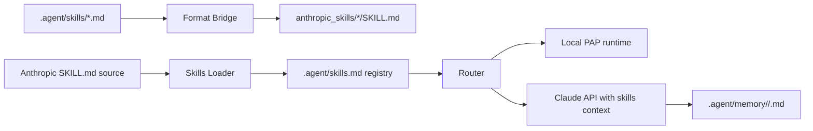

# Anthropic Skills Integration

This document defines how Portable Agent Protocol workspaces interoperate with
Anthropic-style `SKILL.md` folders.

## Positioning

PAP is the orchestration layer. Anthropic skills provide a portable skill
packaging format; PAP adds manifest ownership, memory writeback, prompt and
workflow registries, and runtime routing.

## Compatibility Rules

- PAP skill contracts live in `.agent/skills/<skill_name>.md`.
- Anthropic exports live in `anthropic_skills/<skill-name>/SKILL.md`.
- PAP snake_case skill names convert to Anthropic kebab-case names.
- Anthropic YAML frontmatter must include `name` and `description`.
- Exported skills keep the original PAP contract under `## PAP Contract`.
- Synced external skills are listed in `.agent/skills.md` with
  `source: anthropic` and do not become local runtime tools until a matching
  `agent_runtime/tools/<skill_name>.py` exists.

## Runtime Flow

## Design Decisions

- Anthropic SDK is optional. Bridge, loader, export, sync, and compatibility
  validation run without an API key.
- Claude API Skills use the Messages API `container.skills` shape with code
  execution enabled. Local exported skill folders must be uploaded first or
  referenced by an existing custom skill id before the API can load them as
  Skills.
- Memory writeback is markdown-first so generated execution records remain
  inspectable and portable.
- Local PAP skills win name conflicts during registry sync. This preserves the
  executable runtime contract and prevents external registry updates from
  shadowing local tools.
- The bridge is intentionally format-focused. It does not execute skill logic.
  Execution remains owned by the router or by an external model runtime.
