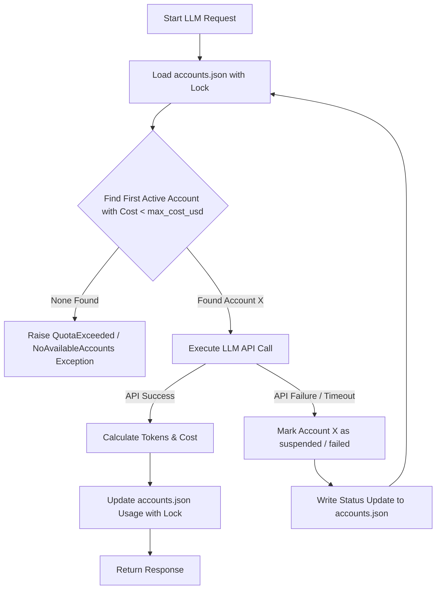

# 🧠 Specification: Token Auditing, Auto-Failover & Strict Schema Validation

This document establishes the declarative specifications and architectural blueprints for **Task 3-05** and **Task 3-06**. The Programmer Agent must adhere strictly to these schemas and logic pipelines during implementation.

---

## 🗂️ 1. `accounts.json` Schema Specification

The multi-account configuration file must be stored in `.agent/memory/persistent/accounts.json` or `.agent/accounts.json`. It maps multiple LLM provider options and tracks remaining token/cost limits.

```json
{
  "$schema": "http://json-schema.org/draft-07/schema#",
  "title": "AccountManagerConfig",
  "type": "object",
  "properties": {
    "accounts": {
      "type": "array",
      "items": {
        "type": "object",
        "required": ["id", "provider", "api_key", "model", "pricing", "limits", "usage"],
        "properties": {
          "id": { "type": "string" },
          "provider": { "type": "string", "enum": ["gemini", "openai", "anthropic", "openrouter", "mock"] },
          "api_key": { "type": "string" },
          "model": { "type": "string" },
          "pricing": {
            "type": "object",
            "required": ["prompt_price_per_million", "completion_price_per_million"],
            "properties": {
              "prompt_price_per_million": { "type": "number" },
              "completion_price_per_million": { "type": "number" }
            }
          },
          "limits": {
            "type": "object",
            "required": ["max_cost_usd"],
            "properties": {
              "max_cost_usd": { "type": "number" }
            }
          },
          "usage": {
            "type": "object",
            "required": ["prompt_tokens", "completion_tokens", "total_cost_usd"],
            "properties": {
              "prompt_tokens": { "type": "integer", "minimum": 0 },
              "completion_tokens": { "type": "integer", "minimum": 0 },
              "total_cost_usd": { "type": "number", "minimum": 0 }
            }
          },
          "status": { "type": "string", "enum": ["active", "suspended", "exhausted"], "default": "active" }
        }
      }
    }
  },
  "required": ["accounts"]
}
```

### 🔒 Thread-Safety and Concurrency Policy
- Every read and write access to `accounts.json` must be wrapped with a cross-platform filesystem lock (such as a shared/exclusive lock using a `.lock` file or a dedicated SQLite memory-based mutex).
- In-memory modifications must be flushed immediately (Write-Through pattern) to prevent token counter drift in concurrent tasks.

---

## 🔄 2. Auto-Failover Logic Pipeline

When a skill or standard prompt is executed using the LLM API, the `AgentEngine` must execute the following pipeline:



### Auditing Callbacks & Real-Time Cost Calculation
- **Cost Formula**:
  $$\text{Total Cost (USD)} = \left(\frac{\text{Prompt Tokens} \times \text{Prompt Price}}{1,000,000}\right) + \left(\frac{\text{Completion Tokens} \times \text{Completion Price}}{1,000,000}\right)$$
- If the token counts cannot be parsed or the API fails mid-way, partial tokens must be recorded based on best-effort heuristic counting.

---

## 🛡️ 3. Strict Schema Validation Layer (Task 3-06)

To prevent runtime errors caused by mismatched skill contracts or workflow definitions, a strict static checker must be introduced:

1. **Verification Timing**:
   - During `cli.py lint` checks.
   - Proactively at runtime bootstrap inside `AgentEngine.load_manifest()`.
2. **Enforcements**:
   - `skill.md` or `skill.json` must undergo strict type conversion. For example, ensuring input properties declare exact JSON types (`string`, `integer`, `boolean`, `array`, `object`) rather than loose or undefined fields.
   - `workflow.md` must validate that every transition state references a valid, existing `step_id` or `skill_id`.
