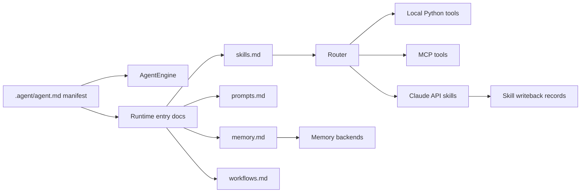

# Portable Agent Protocol (PAP)

[](https://github.com/OPluke11-abula/Portable-Agent-Protocol)
[]()

Portable Agent Protocol is a portable `.agent/` workspace specification plus a
Python reference runtime. It separates an agent's durable collaboration state
from the runtime that executes tools, routes work, manages memory, and applies
workflow contracts.

The repository has two identities:

- A protocol workspace template under `.agent/`
- A Python reference runtime under `agent_runtime/`

That split is intentional. The `.agent/` files describe the portable contract;
the runtime proves that the contract can be loaded, validated, routed, and
executed.

## Why PAP Exists

Modern AI tooling is fragmented across IDE agents, chat products, local
runtimes, MCP tools, and vendor-specific skill formats. PAP gives projects a
stable workspace that can travel between those environments:

- `agent.md` declares the executable manifest and layout.
- `skills.md` registers local and external skills.
- `prompts.md` owns prompt policy and reusable prompt fragments.
- `memory.md` defines durable context conventions.
- `workflows.md` describes repeatable multi-step execution.

An agent can clone a project, read `.agent/agent.md`, and recover the project's
collaboration contract without relying on one vendor's runtime state.

## Agent Onboarding & Bootstrapping (.AGENT)

To enable incoming AI agents to instantly align with their persona, active tasks, and execution rules, the repository defines a root-level onboarding configuration:

*   **[.AGENT.md](.AGENT.md)**: The human-readable and agent-facing entry point. It declares the agent's identity as a Lead Systems Programmer, lists its skills directory (`.agent/skills/`), details its task queue (`agent_tasks.md`), and specifies high-priority post-work execution routines.
*   **[.cursorrules](.cursorrules)**: The IDE integration layer that automatically directs modern AI coding tools to read `.AGENT.md` and `.agent/agent.md` upon session startup.

*Note: Due to case-insensitive naming conflicts on Windows between a root file and a directory sharing the name `.agent`, the root-level configuration is named `.AGENT.md` instead of `.AGENT`.*

## Architecture



The `.agent/` workspace follows a three-layer model:

1. Manifest: `.agent/agent.md` is the executable source of truth.
2. Entry documents: top-level `.agent/*.md` files are runtime-facing registries
   and contracts.
3. Detailed directories: `.agent/*/` folders hold detailed specs, templates,
   and supporting guidance.


## Repository Layout

```text
.AGENT.md                          Root onboarding entrypoint (Windows compatible)
.cursorrules                       Root IDE / agent bridge
.agent/
  agent.md                         Executable PAP manifest
  skills.md                        Runtime-facing skill registry
  prompts.md                       Prompt registry
  memory.md                        Memory contract
  memory/                          Tiered Memory Storage
    episodic/                      Turn-by-turn history (.jsonl)
    semantic/                      Durable structured knowledge (.json)
    handoff/                       Inter-agent context packets (.json)
    schema.json                    JSON Schema for memory validation
  workflows.md                     Workflow registry

spec/                              Protocol JSON Schema Definitions
  agent-schema.json                JSON Schema for agent.md manifest
  skill-contract.schema.json       JSON Schema for skill contracts
  memory.schema.json               JSON Schema for memory layouts
  workflow.schema.json             JSON Schema for workflows

agent_runtime/
  engine.py                        Runtime bootstrap and layout validation
  router.py                        Local, MCP, and Claude API dispatch

  memory/
    __init__.py                    Memory backends
    writeback.py                   Skill execution writeback
tests/                             Pytest coverage for runtime and integrations
```

## Protocol Schema Validation (`spec/`)

To ensure vendor-agnostic portability and strict structural integrity, the Portable Agent Protocol utilizes standard **JSON Schema (Draft-07)** to formally define and validate all core configuration files.

The schemas are defined under the `spec/` directory:
- **[agent-schema.json](file:///D:/GitHub/Portable-Agent-Protocol/spec/agent-schema.json)**: Standardizes the executable manifest `.agent/agent.md` YAML front-matter (e.g. tools, memory tiers, protocol layout, runtime settings).
- **[skill-contract.schema.json](file:///D:/GitHub/Portable-Agent-Protocol/spec/skill-contract.schema.json)**: Outlines capability contracts in `.agent/skills/*.md`.
- **[memory.schema.json](file:///D:/GitHub/Portable-Agent-Protocol/spec/memory.schema.json)**: Formulates long-term, semantic, episodic, and handoff memory formats.
- **[workflow.schema.json](file:///D:/GitHub/Portable-Agent-Protocol/spec/workflow.schema.json)**: Structures the steps and dependency graphs (DAG) in `.agent/workflows/*.md`.

Runtimes validate these layouts automatically during bootstrap. You can trigger manual validation using the CLI:
```bash
python cli.py validate
```


## Installation

```bash
git clone https://github.com/OPluke11-abula/Portable-Agent-Protocol.git
cd Portable-Agent-Protocol
pip install -e .
```

For development:

```bash
pip install -e ".[dev]"
```


## CLI

Initialize or validate a PAP workspace:

```bash
python cli.py init
python cli.py validate
```

Run a local PAP tool:

```bash
python cli.py --tool search_web --params '{"query":"portable agents"}'
```


## Memory

The Python runtime supports:

- `in_memory`
- `local` / `json`
- `sqlite`
- `vector` placeholder backend

The memory package preserves the public import surface:

```python
from agent_runtime.memory import create_memory_backend
from agent_runtime.memory.writeback import write_skill_result
```

## MCP Bridge

PAP and MCP solve different layers:

- MCP defines how an agent calls external tools.
- PAP defines how an agent workspace, contracts, prompts, workflows, and memory
  move across environments.

Use:

```bash
python cli.py mcp sync
```

to discover MCP tools and materialize local skill contracts under `.agent/`.

## Validation

Run the standard verification set:

```bash
python -m pytest
python -m compileall cli.py agent_runtime tests
```

The layout tests enforce that `.agent/agent.md`, top-level entry documents, and
detailed protocol directories stay aligned.

## Certification

PAP-compatible runtimes should:

1. Parse `.agent/agent.md` frontmatter.
2. Resolve the declared `.agent/` layout.
3. Preserve the three-layer workspace model.
4. Route declared tools without changing existing public contracts.
5. Pass the conformance and runtime tests in this repository.

See [conformance/CERTIFICATION.md](conformance/CERTIFICATION.md) and the
[LAS integration example](examples/las-integration/).
