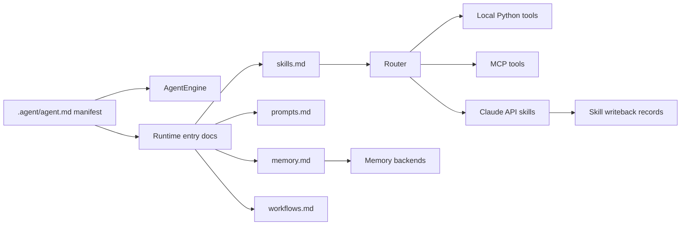
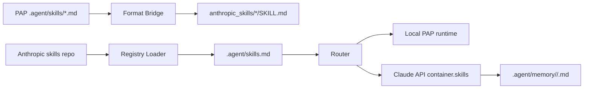

# Portable Agent Protocol (PAP)

[](https://github.com/OPluke11-abula/Portable-Agent-Protocol)
[]()

Portable Agent Protocol is a portable `.agent/` workspace specification plus a
Python reference runtime. It separates an agent's durable collaboration state
from the runtime that executes tools, routes work, manages memory, and applies
workflow contracts.

The repository has two identities:

- A protocol workspace template under `.agent/`
- A Python reference runtime under `agent_runtime/`

That split is intentional. The `.agent/` files describe the portable contract;
the runtime proves that the contract can be loaded, validated, routed, and
executed.

## Why PAP Exists

Modern AI tooling is fragmented across IDE agents, chat products, local
runtimes, MCP tools, and vendor-specific skill formats. PAP gives projects a
stable workspace that can travel between those environments:

- `agent.md` declares the executable manifest and layout.
- `skills.md` registers local and external skills.
- `prompts.md` owns prompt policy and reusable prompt fragments.
- `memory.md` defines durable context conventions.
- `workflows.md` describes repeatable multi-step execution.

An agent can clone a project, read `.agent/agent.md`, and recover the project's
collaboration contract without relying on one vendor's runtime state.

## Architecture



The `.agent/` workspace follows a three-layer model:

1. Manifest: `.agent/agent.md` is the executable source of truth.
2. Entry documents: top-level `.agent/*.md` files are runtime-facing registries
   and contracts.
3. Detailed directories: `.agent/*/` folders hold detailed specs, templates,
   and supporting guidance.

## Anthropic Skills Integration

PAP now interoperates with Anthropic-style Agent Skills. Anthropic skills define
portable skill folders with a top-level `SKILL.md`; PAP provides the upper
orchestration layer around those skills: registry sync, memory writeback,
workflow ownership, prompt policy, and runtime routing.



Supported flows:

- Export local PAP contracts to Anthropic `SKILL.md` folders.
- Load local Anthropic skill folders into `.agent/skills.md`.
- Sync Anthropic's public skills repository directly from GitHub.
- Validate local PAP skill contracts for Anthropic frontmatter compatibility.
- Dispatch through Claude API with PAP memory context and optional
  `container.skills` references for uploaded custom skills or Anthropic
  built-ins.

## Repository Layout

```text
.agent/
  agent.md                         Executable PAP manifest
  skills.md                        Runtime-facing skill registry
  prompts.md                       Prompt registry
  memory.md                        Memory contract
  workflows.md                     Workflow registry
  knowledge_base/
    anthropic_integration.md       PAP x Anthropic design notes
agent_runtime/
  engine.py                        Runtime bootstrap and layout validation
  router.py                        Local, MCP, and Claude API dispatch
  bridges/anthropic_skill_bridge.py
  loaders/anthropic_skills_loader.py
  memory/
    __init__.py                    Memory backends
    writeback.py                   Skill execution writeback
tests/                             Pytest coverage for runtime and integrations
```

## Installation

```bash
git clone https://github.com/OPluke11-abula/Portable-Agent-Protocol.git
cd Portable-Agent-Protocol
pip install -e .
```

For development:

```bash
pip install -e ".[dev]"
```

For Claude API skill dispatch:

```bash
pip install -e ".[anthropic]"
```

## CLI

Initialize or validate a PAP workspace:

```bash
python cli.py init
python cli.py validate
```

Run a local PAP tool:

```bash
python cli.py --tool search_web --params '{"query":"portable agents"}'
```

Export local PAP skill contracts as Anthropic skill folders:

```bash
python cli.py --export-skills --output ./anthropic_skills/
```

Sync Anthropic skills into the PAP registry:

```bash
python cli.py --sync-anthropic-skills --source ./path/to/anthropics/skills/
python cli.py --sync-anthropic-skills --source github:anthropics/skills
```

Validate local skill export compatibility:

```bash
python cli.py --validate-compatibility
```

Dispatch through Claude API:

```bash
python cli.py --tool search_web \
  --params '{"query":"test"}' \
  --via-claude-api \
  --anthropic-skill-id skill_01Example \
  --anthropic-skill-type custom
```

For Anthropic built-in document skills, use the built-in skill id:

```bash
python cli.py --tool xlsx \
  --params '{"task":"Create a budget spreadsheet"}' \
  --via-claude-api \
  --anthropic-skill-id xlsx \
  --anthropic-skill-type anthropic
```

Claude API dispatch requires `ANTHROPIC_API_KEY`. PAP loads recent skill memory
before dispatch and writes the result to `.agent/memory/<skill>/<session>.md`.

## Skill Compatibility Rules

- PAP skill names use snake_case.
- Anthropic skill folder names use kebab-case.
- Exported `SKILL.md` files must have `name` and `description` frontmatter.
- Descriptions must be non-empty and concise.
- Local PAP runtime skills remain authoritative when a synced external skill
  has the same name.
- Synced external skills are registry entries until a runtime tool or uploaded
  Claude API skill id is available.

## Memory

The Python runtime supports:

- `in_memory`
- `local` / `json`
- `sqlite`
- `vector` placeholder backend

The memory package preserves the public import surface:

```python
from agent_runtime.memory import create_memory_backend
from agent_runtime.memory.writeback import write_skill_result
```

## MCP Bridge

PAP and MCP solve different layers:

- MCP defines how an agent calls external tools.
- PAP defines how an agent workspace, contracts, prompts, workflows, and memory
  move across environments.

Use:

```bash
python cli.py mcp sync
```

to discover MCP tools and materialize local skill contracts under `.agent/`.

## Validation

Run the standard verification set:

```bash
python -m pytest
python -m compileall cli.py agent_runtime tests
python cli.py --validate-compatibility
```

The layout tests enforce that `.agent/agent.md`, top-level entry documents, and
detailed protocol directories stay aligned.

## Certification

PAP-compatible runtimes should:

1. Parse `.agent/agent.md` frontmatter.
2. Resolve the declared `.agent/` layout.
3. Preserve the three-layer workspace model.
4. Route declared tools without changing existing public contracts.
5. Pass the conformance and runtime tests in this repository.

See [conformance/CERTIFICATION.md](conformance/CERTIFICATION.md) and the
[LAS integration example](examples/las-integration/).
