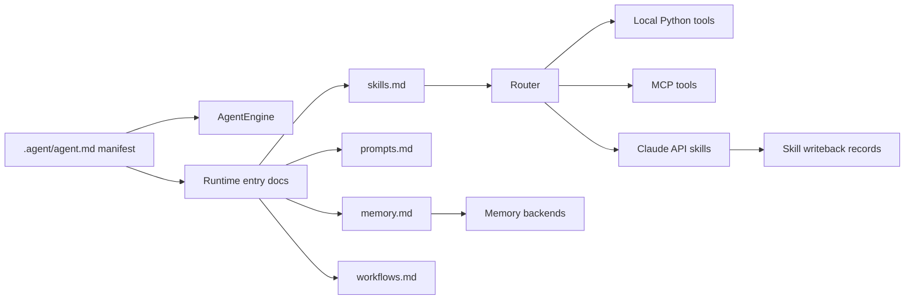

# 可攜式代理協定 (Portable Agent Protocol, PAP)

[](https://github.com/OPluke11-abula/Portable-Agent-Protocol)
[]()

Portable Agent Protocol (PAP) 是一個可攜式的 `.agent/` 工作空間規範，並隨附 Python 參考執行期（Reference Runtime）。它將代理（Agent）的持久協作狀態與執行工具、路由工作、管理記憶及套用工作流合約的執行期進行了解耦與分離。

本儲存庫具有雙重身份：

*   一個位於 `.agent/` 下的協定工作空間模板
*   一個位於 `agent_runtime/` 下的 Python 參考執行期

這種分離是有意為之的。`.agent/` 檔案描述了可攜式合約；而執行期則證明了該合約可以被載入、驗證、路由和執行。

## 為什麼需要 PAP

現代 AI 工具鏈極其碎片化，分散於 IDE 代理、對談產品、本地執行期、MCP 工具及廠商專屬的技能格式中。PAP 為專案提供了一個穩定的工作空間，可以在這些環境之間自由移動：

*   `agent.md` 聲明了可執行的宣示說明檔（Manifest）與版面佈局。
*   `skills.md` 註冊了本地與外部技能。
*   `prompts.md` 擁有 Prompt 策略與可重用的 Prompt 片段。
*   `memory.md` 定義了持久化上下文的規範。
*   `workflows.md` 描述了可重複的多步驟執行工作流。

代理可以克隆專案，讀取 `.agent/agent.md`，並在不依賴任何單一廠商執行期狀態的情況下，恢復專案的協作合約。

## 代理引導與初始化 (.AGENT)

為了讓新進的 AI 代理能立刻對齊其角色身分、活動任務及執行規則，本儲存庫定義了根目錄級別的引導配置：

*   **[.AGENT.md](.AGENT.md)**：供人類閱讀與代理對齊的進入點。宣告了代理的身份為「首席系統程式設計師（Lead Systems Programmer）」、列出其技能目錄（`.agent/skills/`）、詳述其任務佇列（`agent_tasks.md`），並指定了高優先級的工作結束執行規範。
*   **[.cursorrules](.cursorrules)**：IDE 整合層，在工作階段啟動時，自動引導現代 AI 編碼工具讀取 `.AGENT.md` 與 `.agent/agent.md`。

*注意：由於 Windows 系統中根目錄檔案與資料夾同名（大小寫不敏感）的衝突限制，根目錄配置檔案命名為 `.AGENT.md`，而非 `.AGENT`。*

## 架構



`.agent/` 工作空間遵循三層模型：

1.  **宣示說明檔 (Manifest)**：`.agent/agent.md` 是可執行的單一事實來源。
2.  **進入文件 (Entry Documents)**：頂層的 `.agent/*.md` 檔案是面向執行期的註冊表與合約。
3.  **詳細目錄 (Detailed Directories)**：`.agent/*/` 資料夾保存了詳細規格、策略與輔助指引。

## 專案版面佈局

```text
.AGENT.md                          根目錄引導進入點 (Windows 相容)
.cursorrules                       根目錄 IDE / 代理橋接器
.agent/
  agent.md                         可執行的 PAP 宣示說明檔
  skills.md                        面向執行期的技能註冊表
  prompts.md                       Prompt 註冊表
  memory.md                        記憶體合約
  workflows.md                     工作流註冊表

spec/                              協定 JSON Schema 定義目錄
  agent-schema.json                agent.md 宣示檔的 JSON Schema
  skill-contract.schema.json       技能合約的 JSON Schema
  memory.schema.json               記憶體版面佈局的 JSON Schema
  workflow.schema.json             工作流定義的 JSON Schema

agent_runtime/
  engine.py                        執行期啟動與版面佈局驗證
  router.py                        本地、MCP 與 Claude API 分發路由

  memory/
    __init__.py                    記憶體後端實作
    writeback.py                   技能執行回寫器
tests/                             執行期與整合的 Pytest 測試套件
```

## 協協定 Schema 驗證 (`spec/`)

為了確保無廠商鎖定的可攜性與嚴格的結構完整性，可攜式代理協定使用標準的 **JSON Schema (Draft-07)** 來正式定義和驗證所有核心設定檔。

Schema 定義於 `spec/` 目錄下：
*   **[agent-schema.json](spec/agent-schema.json)**：標準化可執行宣示檔 `.agent/agent.md` 的 YAML front-matter（如 tools、memory 階層、協定版面、執行期設定）。
*   **[skill-contract.schema.json](spec/skill-contract.schema.json)**：概述 `.agent/skills/*.md` 中的能力合約。
*   **[memory.schema.json](spec/memory.schema.json)**：規劃長期、語義、情境與交接記憶格式。
*   **[workflow.schema.json](spec/workflow.schema.json)**：建構 `.agent/workflows/*.md` 中的步驟與相依性圖表 (DAG)。

執行期會在啟動時自動驗證這些版面。您可以使用 CLI 觸發手動驗證：
```bash
python cli.py validate
```

## 安裝方式

```bash
git clone https://github.com/OPluke11-abula/Portable-Agent-Protocol.git
cd Portable-Agent-Protocol
pip install -e .
```

開發模式安裝：

```bash
pip install -e ".[dev]"
```

## 命令行介面 (CLI)

初始化或驗證 PAP 工作空間：

```bash
python cli.py init
python cli.py validate
```

執行本地 PAP 工具：

```bash
python cli.py --tool search_web --params '{"query":"portable agents"}'
```

## 記憶體系統

Python 參考執行期支援以下記憶體後端：

*   `in_memory` (隨機存取記憶體)
*   `local` / `json` (本地 JSON 檔案)
*   `sqlite` (本地輕量資料庫)
*   `vector` (向量儲存庫佔位符後端)

記憶體套件保留了公開的導入介面：

```python
from agent_runtime.memory import create_memory_backend
from agent_runtime.memory.writeback import write_skill_result
```

## MCP 橋接器

PAP 與 MCP 解決了不同層次的問題：

*   **MCP** 定義了代理如何呼叫外部工具。
*   **PAP** 定義了代理工作空間、合約、Prompt、工作流和記憶如何在不同環境間流動。

執行以下命令：

```bash
python cli.py mcp sync
```

即可自動搜尋 MCP 伺服器工具並在 `.agent/` 下生成本地技能合約。

## 測試驗證

執行標準的驗證測試集：

```bash
python -m pytest
python -m compileall cli.py agent_runtime tests
```

版面佈局測試會強制確保 `.agent/agent.md`、頂層進入文件與詳細的協定目錄保持對齊。

## 相容性認證

相容於 PAP 的執行期應符合以下標準：

1.  能夠解析 `.agent/agent.md` 的 YAML front-matter。
2.  能夠解析與探索聲明的 `.agent/` 版面佈局。
3.  保留三層工作空間模型。
4.  在不更改現有公共合約的情況下路由聲明的工具。
5.  通過本儲存庫中的相容性與執行期測試。

詳細資訊請參閱 [conformance/CERTIFICATION.md](conformance/CERTIFICATION.md) 以及 [LAS 整合範例](examples/las-integration/)。
