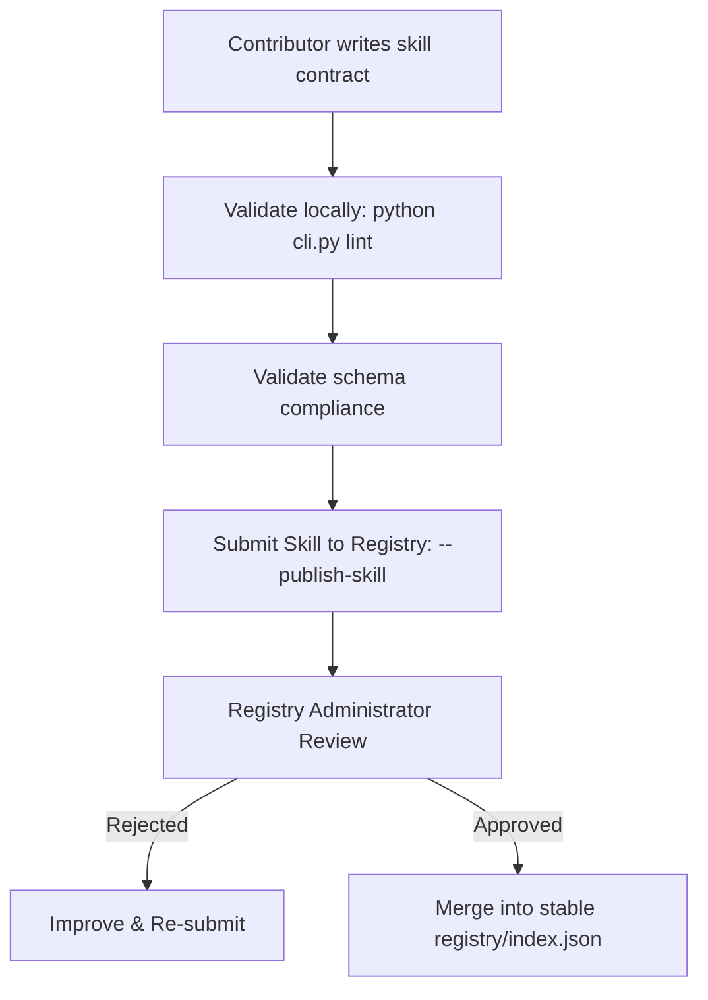

# PAP Public Skill Registry

The Portable Agent Protocol (PAP) public skill registry stores community-contributed skill contracts, enabling agents to install capability definitions dynamically.

## 1. Registry API Specification

To ensure interoperability, any compliant registry server or static registry index must serve a registry index conforming to `spec/registry-schema.json`.

### Index Endpoint
- **URL**: `/index.json`
- **Method**: `GET`
- **Response Format**: `application/json`
- **Schema**:
```json
{
  "registry_version": "1.0.0",
  "skills": {
    "search_web": {
      "id": "search_web",
      "name": "search_web",
      "version": "1.0.0",
      "description": "Search trusted web sources and return cited summaries.",
      "author": "pap-community",
      "path": "skills/search_web.md"
    }
  }
}
```

### Skill Contract Download
- **URL**: `/skills/{skill_id}.md`
- **Method**: `GET`
- **Response Format**: `text/markdown` (Markdown with compliant YAML front-matter conforming to `spec/skill-contract.schema.json`)

---

## 2. Publish-and-Review Workflow Specification

To register a community skill, contributors must follow the formal quality assurance and review workflow:



### Review Criteria:
1. **Schema Compliance**: The contract YAML frontmatter must validate perfectly against `spec/skill-contract.schema.json`.
2. **Identification Rule**: The `id` and `name` must be identical (alphanumeric, hyphens, underscores).
3. **Semver Rule**: The `version` must be a valid semver string (e.g., `1.0.0`).
4. **Input/Output Typing**: Every input and output must declare a strict type (`string`, `integer`, `boolean`, `number`, `float`, `array`, `object`) and a clear description.
5. **Operational Constraints**: At least one constraint must be defined in `safety_notes`.
6. **No Vendor Lock-In**: Avoid proprietary model names or vendor terms (e.g. `anthropic`, `openai`, `gemini`, `claude`) in the contract text.
7. **Approved Status**: Only stable, approved skill contracts are indexed and served to runtime environments.
