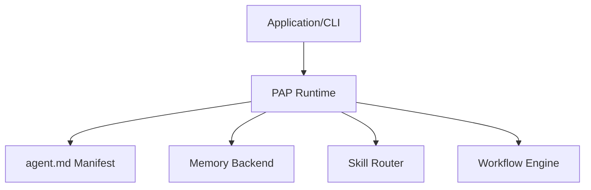

# Portable Agent Protocol Runtime Interface Specification

This document defines the standard API interface and contract that any runtime (regardless of language) must implement to support the Portable Agent Protocol (PAP) v1.0.0.

---

## 1. Overview

A PAP-compliant runtime acts as the host environment for executing agent capabilities, maintaining persistent state, managing workflows, and communicating across agents. It must expose a set of standard interface methods to downstream applications, tools, and execution harnesses.



---

## 2. Core API Methods

Every runtime must expose the following core API methods (or language-idiomatic equivalents) with the specified JSON-compatible behavior.

### 2.1 `load_manifest(config_path: String) -> Object`

Parses the YAML front-matter of the agent manifest (typically `agent.md`) and returns the parsed config object. It must validate the manifest structure against the schema.

*   **Inputs**:
    *   `config_path` (String): The path to the manifest file (default: `.agent/agent.md`).
*   **Outputs**:
    *   Returns a dictionary/object representing the parsed manifest configuration.
*   **Exceptions**:
    *   Throws or returns an error if the manifest is missing, has invalid YAML format, or fails schema validation.

---

### 2.2 `list_skills() -> Array<Object>`

Lists all skills that are currently active in the workspace and registered under the agent configuration.

*   **Inputs**: None
*   **Outputs**:
    *   Returns an array of skill metadata objects. Each object must contain:
        *   `id` (String): Unique identifier of the skill.
        *   `name` (String): Human-friendly name of the skill.
        *   `description` (String): A summary of the skill's function.
        *   `version` (String): SemVer version of the skill.

---

### 2.3 `call_skill(skill_id: String, params: Object) -> Object`

Invokes a specific skill contract with the provided parameter inputs. The runtime must validate the parameters against the skill contract input schema before execution.

*   **Inputs**:
    *   `skill_id` (String): The unique ID of the skill to execute.
    *   `params` (Object): A key-value object containing the inputs/parameters for the skill.
*   **Outputs**:
    *   Returns a key-value object containing the outputs returned by the skill execution.
*   **Exceptions**:
    *   Throws or returns an error if the skill is not found, if validation of the input parameters fails, or if execution fails.

---

### 2.4 `read_memory(key: String) -> Any`

Reads a value from the persistent memory store by its key.

*   **Inputs**:
    *   `key` (String): The key identifier for the memory record.
*   **Outputs**:
    *   Returns the stored value (primitive, list, or object), or `null` / `None` if the key does not exist.

---

### 2.5 `write_memory(key: String, value: Any) -> Boolean`

Writes or updates a value in the persistent memory store.

*   **Inputs**:
    *   `key` (String): The key identifier.
    *   `value` (Any): The value to persist (must be serializable to JSON/SQLite).
*   **Outputs**:
    *   Returns `true` on success, `false` otherwise.

---

### 2.6 `run_workflow(workflow_id: String, params: Object) -> Object`

Executes a multi-step workflow graph by its ID, using the provided parameter inputs.

*   **Inputs**:
    *   `workflow_id` (String): The unique workflow identifier.
    *   `params` (Object): Initial input parameters or variables for the workflow.
*   **Outputs**:
    *   Returns a key-value object containing the final output values of the workflow execution.
*   **Exceptions**:
    *   Throws or returns an error if the workflow is not found, contains cycles, has missing step dependencies, or fails during execution.

---

## 3. Error Representation

When an API call fails, the runtime must return or throw a structured error object conforming to the following shape:

```json
{
  "error": {
    "code": "VALIDATION_ERROR",
    "message": "Input 'query' is required for search_web.",
    "details": {
      "missing_fields": ["query"]
    }
  }
}
```

### Standard Error Codes

*   `MANIFEST_NOT_FOUND`: The manifest file was not found at the specified path.
*   `MANIFEST_INVALID`: Manifest parsing or schema validation failed.
*   `SKILL_NOT_FOUND`: The requested skill does not exist or is not registered.
*   `VALIDATION_ERROR`: Input parameters failed to validate against the skill contract schema.
*   `WORKFLOW_NOT_FOUND`: The requested workflow file does not exist.
*   `WORKFLOW_CYCLE`: Circular dependency detected in workflow DAG.
*   `EXECUTION_ERROR`: General runtime exception during skill or workflow execution.
